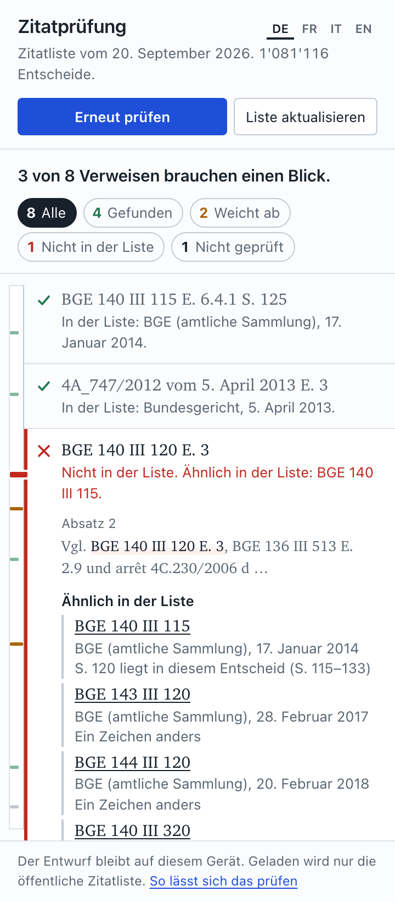

# citecheck

A Word add-in for courts (in the pane: Zitatprüfung, Contrôle des citations,
Controllo delle citazioni). It reads the draft decision, finds the references to
case law and checks each one against the public OpenCaseLaw cite list: is there
a decision under this label, and does it have the cited Erwägung? The check runs
in the task pane on the workstation. The draft is not sent anywhere.



MIT licence. No account, no server of ours in the loop, no language model.
About 2,000 lines of plain JavaScript, CSS and Python with no dependencies, so
that a court's IT can read all of it.

## What it checks

| The draft says | The pane answers |
|---|---|
| `BGE 140 III 115 E. 2.3 S. 118` | Found: court and date from the list. E. 2.3 exists. P. 118 lies within the decision. |
| `BGE 140 III 115 E. 2.7` | Differs: the list has no E. 2.7 for this decision; it lists 2.1, 2.2, 2.3. |
| `BGE 140 III 118` | Not in the list. P. 118 lies within BGE 140 III 115 (the pinpoint page was written as the first page). |
| `Urteil 4A_774/2013 vom 20. Juni 2013` | Not in the list. One character apart and with that date: 4A_774/2012. |
| `Urteil 4A_747/2012 vom 5. Mai 2013` | Differs: the list has 5 April 2013. If a neighbouring number carries the written date, it is offered. |
| `Urteil des Bundesverwaltungsgerichts 4A_747/2012` | Differs: under this number the list has a decision of the Bundesgericht. |
| `ZR 110 Nr. 23` | Not checked: the list does not cover journals and reporters. |

Recognised: BGE/ATF/DTF, file numbers of the Bundesgericht (all three spellings:
`4A_747/2012`, `4A 747/2012`, `4C.230/2006`), Bundesverwaltungsgericht and
Bundesstrafgericht, cantonal numbers after a court name, and any number-like
string the list happens to know. Interface in German, French, Italian and English.

What it does not do, and says so in the pane:

- It does not judge whether a decision supports what the draft says.
- "Not in the list" is not "does not exist". Courts cite unpublished and very
  recent decisions; the pane states what the list holds for that court.
- An Erwägung can only be checked where OpenCaseLaw has the decision's numbering
  (about three quarters of the corpus). Elsewhere the pane says "cannot be checked".
- When a reference has several pinpoints ("E. 2.3 und 2.4"), the first is checked.
- Every decision found, and every near label offered, links to the decision on
  opencaselaw.ch, at the Erwägung where the list has it. The link is only followed
  when clicked.
- It never changes the draft. It can select a reference and, if asked, attach a
  Word comment to it.

## How it stays local

Read [SECURITY.md](SECURITY.md) for the data flow and how to verify it. In short:
the page's Content-Security-Policy allows connections to its own origin only, so
the browser refuses anything else; the only download is the cite list, a public
file that is the same for everyone; `tests/egress.test.mjs` pins all of this.

## Install

The hosted copy is served from GitHub Pages at https://jonashertner.github.io/citecheck/
(the same files as this repository, plus the current cite list). A court that
wants nothing to leave its network hosts the folder itself: [docs/deployment.md](docs/deployment.md).

Word for Mac, for one user (then restart Word; Home, Add-ins, under "Developer Add-ins"):

```
mkdir -p ~/Library/Containers/com.microsoft.Word/Data/Documents/wef
curl -fsSL https://jonashertner.github.io/citecheck/manifest.xml -o ~/Library/Containers/com.microsoft.Word/Data/Documents/wef/citecheck.xml
```

Word for Windows: download the same `manifest.xml` to a shared folder and add that
folder as a trusted add-in catalog (deployment guide, step 4), or upload it in the
Microsoft 365 admin centre.

## Without Word

Open https://jonashertner.github.io/citecheck/taskpane.html in a browser and choose
or drop the `.docx` (or paste text). The file is read and checked in the page; it
is not uploaded. Footnotes are included, text marked as deleted by tracked changes
is not. In Word none of this is needed: the add-in reads the open draft directly.

## Parts

```
addin/            the add-in: static files, served by any web server
  taskpane.html   the page, with the Content-Security-Policy
  js/parser.js    finds references in prose (port of the OpenCaseLaw research client, `ocl`)
  js/index.js     the cite list: download, SHA-256 check, cache, binary search
  js/check.js     the rules: found / differs / not in the list / not checked
  js/word.js      the three things asked of Word: read, select, comment
  js/docx.js      outside Word: reads a .docx in the page (unzip + paragraph text)
  js/app.js       the pane
  index/          where the cite list is served from (index.json + one .tsv.gz)
build/
  build_cite_index.py   verification pack -> cite list (standard library only)
  make_manifest.py      the Office manifest for your host
  make_icons.py         the icons (Pillow)
tests/            node --test and pytest; no network
docs/deployment.md      for the court's IT
```

## The cite list

One gzip text file, one line per label and decision, sorted by label:

```
#ocl-cite-index 1
4A_747/2012<TAB>bger<TAB>CH<TAB>2013-04-05<TAB>1,2,3.1,3.2,3.3,4,5,6<TAB>bger_4A_747_2012
BGE 140 III 0115<TAB>bge<TAB>CH<TAB>2014-01-17<TAB>2,3,4,5,6,6.1,6.2<TAB>bge_BGE_140_III_115
```

No text of any decision, no names, nothing from a court's own files. The pane
holds the file as bytes and searches it in place. The list of 20 September 2026:
1,081,116 decisions under 1,111,445 labels, 851,009 of them with their Erwägung
numbers; 16.7 MB to download, 111 MB in memory, opened in about 0.1 s. A lookup
takes microseconds, a draft with 800 references under 0.2 s (`node tests/bench.mjs`).

`index.json` next to it carries the date, the counts per court and the SHA-256
the pane verifies before it uses a download. The pane asks for `index.json`
when it opens, when "Liste aktualisieren" is pressed, and at the start of every
check, so a check always runs against the newest list; the list itself is
downloaded only when its hash changed. Without a connection it checks with the stored list and says so.

Build it from the OpenCaseLaw verification pack (`ocl pack pull`, about 8 GB):

```
python build/build_cite_index.py --pack verification_pack.sqlite --out addin/index
```

The output is byte-for-byte reproducible from the pack.

## Try it without Word

```
python tests/make_fixture_pack.py /tmp/pack.sqlite
python build/build_cite_index.py --pack /tmp/pack.sqlite --out addin/index --sample
python -m http.server 8377 --bind 127.0.0.1 --directory addin
```

Open http://127.0.0.1:8377/taskpane.html and paste text. The fixture holds 13
invented decisions; the pane marks such a list as a sample.

## Tests

```
npm test                 # node >= 20: parser, list search, rules, data-flow guarantees
python -m pytest tests   # the list builder
```

## State

Version 0.1.0. Verified in headless Chromium: the pane, the list download and
cache, the checks, and that Microsoft's office.js loads under the policy without
a violation. **Not yet run inside Word**: `js/word.js` follows the documented
Word API but has not been
exercised against a real document, and the manifest has not been through
Microsoft's validator (`npx office-addin-manifest validate manifest.xml`).
Both are the first steps of a pilot. Needs Microsoft 365 or Office 2021 and
later (Windows: WebView2), or current Word for Mac; Office 2016/2019 volume
licences embed an older browser and are not supported.
