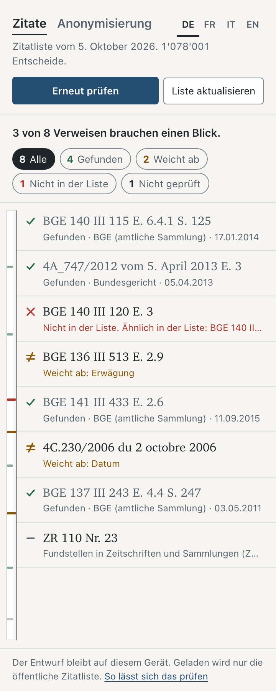
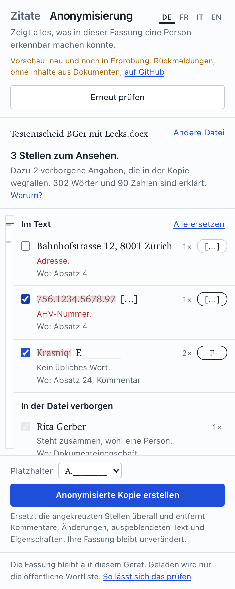

# citecheck

A Word add-in for courts with two checks, both run in the task pane on the
workstation; the document is not sent anywhere.

- **Zitate** (Citations, Citazioni): finds the references to case law in a draft
  and checks each against the public OpenCaseLaw cite list. Is there a decision
  under this label, and does it have the cited Erwägung?
- **Anonymisierung** (Anonymisation, Anonimizzazione): shows everything in the
  version to be published that could make a person identifiable, lets the
  clerk tick what to replace, and writes an anonymized copy that it checks again
  before handing it out.



MIT licence. No account, no server of ours in the loop, no language model.
About 3,000 lines of plain JavaScript, plus CSS and Python, with no
dependencies, so that a court's IT can read all of it.

## What it checks

| The draft says | The pane answers |
|---|---|
| `BGE 140 III 115 E. 2.3 S. 118` | Found: court and date from the list. E. 2.3 exists. P. 118 lies within the decision. |
| `BGE 140 III 115 E. 2.7` | Differs: the list has no E. 2.7 for this decision; it lists 2.1, 2.2, 2.3. |
| `BGE 140 III 118` | Not in the list. P. 118 lies within BGE 140 III 115 (the pinpoint page was written as the first page). |
| `Urteil 4A_774/2013 vom 20. Juni 2013` | Not in the list. One character apart and with that date: 4A_774/2012. |
| `Urteil 4A_747/2012 vom 5. Mai 2013` | Differs: the list has 5 April 2013. If a neighbouring number carries the written date, it is offered. |
| `Urteil des Bundesverwaltungsgerichts 4A_747/2012` | Differs: under this number the list has a decision of the Bundesgericht. |
| `ZR 110 Nr. 23` | Not checked: the list does not cover journals and reporters. |

Recognised: BGE/ATF/DTF, file numbers of the Bundesgericht (all three spellings:
`4A_747/2012`, `4A 747/2012`, `4C.230/2006`), Bundesverwaltungsgericht and
Bundesstrafgericht, cantonal numbers after a court name, and any number-like
string the list happens to know. Interface in German, French, Italian and English.

What it does not do, and says so in the pane:

- It does not judge whether a decision supports what the draft says.
- "Not in the list" is not "does not exist". Courts cite unpublished and very
  recent decisions; the pane states what the list holds for that court.
- An Erwägung can only be checked where OpenCaseLaw has the decision's numbering
  (about three quarters of the corpus). Elsewhere the pane says "cannot be checked".
- When a reference has several pinpoints ("E. 2.3 und 2.4"), the first is checked.
- Every decision found, and every near label offered, links to the decision on
  opencaselaw.ch, at the Erwägung where the list has it. The link is only followed
  when clicked.
- It never changes the draft. It can select a reference and, if asked, attach a
  Word comment to it.

## The anonymization check



One rule: **everything the file carries is either explained or shown.** A word
or number is explained when it is

- **common**: a word found in many published rulings that is not a person's
  name (the word list, below), in German also a compound of such words
  ("Schneelast"; French, Italian and English do not close compounds up, and a
  made-up name such as "Equibelle" would split), or a number of a common shape
  (date, amount, legal reference, docket, section, count);
- **made public by the ruling itself**: the bench, counsel and officials named
  with their office, authors and case names inside citations. Public is the
  person, not the surname: "Anna Müller" next to "Bundesrichter Hans Müller",
  or a party word before a name ("Die Klägerin Hans Müller"), is someone else
  and is shown, and then so is every bare "Müller". A category the ruling
  anonymizes itself (counsel written as B.________) is not explained;
- **a placeholder**: A.________, [...], X.

One exception, stated in the pane after every check: a single lower-case word
that the word list does not know and that is no compound of known words is
counted, not shown. Two or more such words in a row are shown, so a name
written all in lower case ("hans müller") is one more person. On 2,000 held-out
rulings two thirds have no such single word (median 0, 90th percentile 4); the
rest are mostly typos and foreign words.

Everything else is shown, grouped by person, not by word: "Hans Müller",
"HANS MÜLLER", "H. Müller" and "Hans" are one entry with every place it stands,
and "Anna Müller" is another. A name written alone ("Müller", "Müllers") goes to
the one person it fits; where it fits several, it gets an entry of its own and
the clerk chooses the letter, for all places or place by place. A recognised identifier is shown with its
label even when its parts are common words: AHV number (check digit verified),
IBAN, phone number, e-mail address, social media profile, street address
(also a postcode before a placeholder: "68740 E.________" names the town), number plate, land parcel, date of birth, insured-person or policy number,
ZEMIS number, ID document number, account number. The same details of an
office, an insurer, a company or counsel are explained.

"Everything the file carries" includes what a reader does not see: comments
(and their authors), text deleted with tracked changes, hidden text (also
hidden by a style), field codes, image descriptions, document properties and
variables, names and tags of content controls, data a case-management system
left in `customXml/`, where links lead (`https://`, `mailto:`), the file name.
Text is compared in composed form, so a name typed with a combining umlaut
(`u` + U+0308) is the same name.

The clerk ticks what to replace; a person gets one letter wherever and however
the name is written (letters already used by the document are skipped; after
Z come AA, AB …, never a letter in use). A tick changes nothing in the open
document; the open row shows the result in its sentence ("~~Hans Müller~~
A.________"), and the arrow keys step through the places in Word.
**"Create anonymised copy"** writes a new `.docx`:

- every ticked place replaced as the name is written, with its initial and both
  halves of a double name ("H. Müller", "Müller-Meier"), also where Word split it
  across formatting runs; a genitive keeps its s ("A.________s Anwalt");
- tracked changes accepted, deletions gone; comments, hidden text (also when a
  style hides it), document properties, content-control names and tags, the
  page thumbnail, custom XML, document variables and the template path
  removed; ticked names and identifiers replaced in link targets too;
- each place is replaced only where its paragraph still reads what the check
  showed; then the copy is compared with the original paragraph by paragraph,
  independently of the check: exactly the ticked places replaced, nothing else
  changed, or the copy is not handed out;
- the copy is read back and checked like any document, including for an initial
  or a name left next to a placeholder ("H. A.________"); only then is it opened
  as a new Word document (or offered as a download). The result says what was
  done and what the clerk left (shown, neither ticked nor confirmed), never more.

Word writes the editor's name into the properties of a file it saves: the saved
copy is worth one more check before it is published.

The copy is written from the document as it is when the copy is made (a bold
set after the check is kept); if any part reads differently from the check, the
pane asks for a new check first. The open document is never changed.

What it does not do, and says so in the pane:

- It does not judge whether several common facts together (age, place,
  occupation) make a person identifiable.
- Text inside images is not read; embedded files are not checked.
- It decides nothing: what is shown, the clerk decides on.

How well it works is measured, not claimed: [docs/benchmark-anonymization.md](docs/benchmark-anonymization.md)
gives the figures on 5,724 published, anonymized rulings the word list never saw. In short: every
identifier put next to a placeholder (AHV number, IBAN, mobile, address, plate, parcel, date of birth)
is shown; a name missed in one place is shown in about 96 to 97 % of cases; a German ruling shows a
median of 5 entries to look at, a French one 4. Where a surname is also an ordinary word (Frei, Sommer)
the check cannot always tell, unless a title stands before it ("Herr Frei" is shown); the report says
how often.

## How it stays local

Read [SECURITY.md](SECURITY.md) for the data flow and how to verify it. In short:
the page's Content-Security-Policy allows connections to its own origin only, so
the browser refuses anything else; the only downloads are the cite list and the
word list, public files that are the same for everyone; `tests/egress.test.mjs`
pins all of this.

## Install

The hosted copy is served from GitHub Pages at https://jonashertner.github.io/citecheck/
(the same files as this repository, plus the current cite list). The manifest is
also served from mcp.opencaselaw.ch, where downloads are counted per day
from the web server log and kept in a small daily record (`build/nginx/`,
`build/systemd/citecheck-downloads.*`); only the date, a count and a count of
distinct addresses are kept. It names the GitHub Pages address, so the add-in itself
runs from there either way. A court that
wants nothing to leave its network hosts the folder itself: [docs/deployment.md](docs/deployment.md).

Testers without a command line: send them https://jonashertner.github.io/citecheck/ ,
which has the file to download and the steps for Word on Windows, in the browser
and on Mac (web: Insert, Add-ins, My Add-ins, Manage My Add-ins, Upload My Add-in;
Windows: a shared folder added as a trusted add-in catalog, see below).

Word for Mac, for one user (then restart Word; Home, Add-ins, under "Developer Add-ins"):

```
mkdir -p ~/Library/Containers/com.microsoft.Word/Data/Documents/wef
curl -fsSL https://mcp.opencaselaw.ch/citecheck/manifest.xml -o ~/Library/Containers/com.microsoft.Word/Data/Documents/wef/citecheck.xml
```

Word for Windows: download the same `manifest.xml` to a shared folder and add that
folder as a trusted add-in catalog (deployment guide, step 4), or upload it in the
Microsoft 365 admin centre.

## Without Word

Open https://jonashertner.github.io/citecheck/taskpane.html in a browser and choose
or drop the `.docx` (or paste text). The file is read and checked in the page; it
is not uploaded. Footnotes are included, text marked as deleted by tracked changes
is not. In Word none of this is needed: the add-in reads the open draft directly.

## Parts

```
addin/            the add-in: static files, served by any web server
  taskpane.html   the page, with the Content-Security-Policy
  js/parser.js    finds references in prose (port of the OpenCaseLaw research client, `ocl`)
  js/index.js     the cite list: download, SHA-256 check, cache, binary search
  js/check.js     the rules: found / differs / not in the list / not checked
  js/word.js      what is asked of Word: read, select, comment, open the anonymized copy
  js/docx.js      outside Word: reads a .docx in the page (unzip + paragraph text)
  js/app.js       the pane
  js/anon.js      the anonymization check (pure); js/anon-patterns.js its patterns
  js/vocabulary.js  the word list: binary search over its bytes
  js/docfile.js   everything a .docx carries; writes the anonymized copy
  js/anon-pane.js the anonymization mode of the pane
  index/          where the cite list is served from (index.json + one .tsv.gz)
  data/           the word list (vocabulary.json + one .txt.gz), in the repository
build/
  build_cite_index.py   verification pack -> cite list (standard library only)
  anon_engine.py        the anonymization check in Python, the twin of anon.js
  build_vocabulary.py   corpus + name lists -> word list
  name_lists.py         reads the name lists (build time only)
  bench_anon.py         the benchmark on held-out rulings
  make_manifest.py      the Office manifest for your host
  make_icons.py         the icons (Pillow)
tests/            node --test and pytest; no network
docs/deployment.md      for the court's IT
```

## The cite list

One gzip text file, one line per label and decision, sorted by label:

```
#ocl-cite-index 1
4A_747/2012<TAB>bger<TAB>CH<TAB>2013-04-05<TAB>1,2,3.1,3.2,3.3,4,5,6<TAB>bger_4A_747_2012
BGE 140 III 0115<TAB>bge<TAB>CH<TAB>2014-01-17<TAB>2,3,4,5,6,6.1,6.2<TAB>bge_BGE_140_III_115
```

No text of any decision, no names, nothing from a court's own files. The pane
holds the file as bytes and searches it in place. The list of 20 September 2026:
1,081,116 decisions under 1,111,445 labels, 851,009 of them with their Erwägung
numbers; 16.7 MB to download, 111 MB in memory, opened in about 0.1 s. A lookup
takes microseconds, a draft with 800 references under 0.2 s (`node tests/bench.mjs`).

`index.json` next to it carries the date, the counts per court and the SHA-256
the pane verifies before it uses a download. The pane asks for `index.json`
when it opens, when "Liste aktualisieren" is pressed, and at the start of every
check, so a check always runs against the newest list; the list itself is
downloaded only when its hash changed. Without a connection it checks with the stored list and says so.

Build it from the OpenCaseLaw verification pack (`ocl pack pull`, about 8 GB):

```
python build/build_cite_index.py --pack verification_pack.sqlite --out addin/index
```

or, on the OpenCaseLaw host, from the nightly corpus files (Parquet export,
decisions.db, decision_structure.db; needs pyarrow):

```
python build/build_cite_index.py --dataset-dir output/dataset --decisions-db output/decisions.db --structure-db output/decision_structure.db --out index
```

Both give the same list for the same corpus state; the output is byte-for-byte
reproducible. The hosted list is rebuilt every night by
`build/publish_cite_index.py` (systemd units in `build/systemd/`), uploaded to
the HuggingFace mirror and picked up by the Pages workflow.

## The word list

One gzip text file: a header, then one lower-case word per line, sorted by UTF-8
bytes; lines starting with `!` mark names the compound rule must not explain
(Hof+mann is a name, Schnee+last is not). It holds no text of any ruling and no
name. A word is in it when it occurs in at least 5 published rulings of at least
2 courts and is not a person's name. A word that is also a name (on the lists of
surnames and first names of the Swiss resident population, or a Wikidata family
or given name) stays in only when the corpus uses it as an ordinary word: written
in lower case at least as often as capitalised, or at least 100 times more
frequent in rulings than among residents and rarely after a title or an office.
A family name found only on Wikidata (no Swiss resident bears it) is a word when
the corpus, in at least 100 rulings of 10 courts, never writes it after a title,
an office or a first name ("Rentner", "Kaffee", "Word").
"März", "Recht" and "Basler" are common; "Seiler" and "Meyer" stay names however
often judges carry them. Inflected names ("Müllers") are judged like the name.

Sources: the OpenCaseLaw corpus (HuggingFace `voilaj/swiss-caselaw`, CC0); the
Federal Statistical Office (BFS) lists of surnames and first names of the
permanent resident population (opendata.swiss; source: BFS); Wikidata family
and given names (CC0). The name lists are used when the list is built and are
not shipped.

```
python build/build_vocabulary.py --download /tmp/hf --names-dir names/ --out addin/data
```

reads the 120 court files of the mirror one at a time (download, count, delete;
about 45 minutes) and needs pyarrow. `--holdout 10` leaves every tenth ruling
out for the benchmark; `--stats FILE` keeps the counts so the rules can be
adjusted (`--from-stats`) without reading the corpus again.

## Try it without Word

```
python tests/make_fixture_pack.py /tmp/pack.sqlite
python build/build_cite_index.py --pack /tmp/pack.sqlite --out addin/index --sample
python -m http.server 8377 --bind 127.0.0.1 --directory addin
```

Open http://127.0.0.1:8377/taskpane.html and paste text. The fixture holds 13
invented decisions; the pane marks such a list as a sample.

## Tests

```
npm test                 # node >= 20: parser, list search, rules, anonymization check
                         # (and its parity with the Python twin), .docx reading and
                         # writing, data-flow guarantees
python -m pytest tests   # the list builders
```

## State

**Anonymization check: preview** (2026-10-08). Verified in headless Chromium outside Word: reading every
part of a .docx, the check, the list, keyboard use, the anonymized copy and its re-check; the copy also
reads cleanly in macOS's own .docx reader (`textutil`). Not yet run inside Word: whether
`getFileAsync` hands over unsaved changes, selecting a place, and opening the copy as a new document are
the first things to confirm there. The pane marks the mode as a preview and asks for feedback on GitHub,
without content from documents.

**Cite check:**

Version 0.1.0 (manifest 1.0.0.0, which Microsoft's validator requires). Verified in headless Chromium: the pane, the list download and
cache, the checks, and that Microsoft's office.js loads under the policy without
a violation. Run inside Word for Mac 16.113 (Microsoft 365) on 2026-09-22 against a real
document with a native footnote: reading, selecting each occurrence, footnotes,
comments, links, language switch and the cached list all verified; two defects
found there (the second occurrence of a repeated reference selected the first;
the link to E. 3 lacked its anchor when the list holds 3.1 but no 3) are fixed.
The manifest passes Microsoft's validator. Not yet run on Windows. Needs Microsoft 365 or Office 2021 and
later (Windows: WebView2), or current Word for Mac; Office 2016/2019 volume
licences embed an older browser and are not supported.
